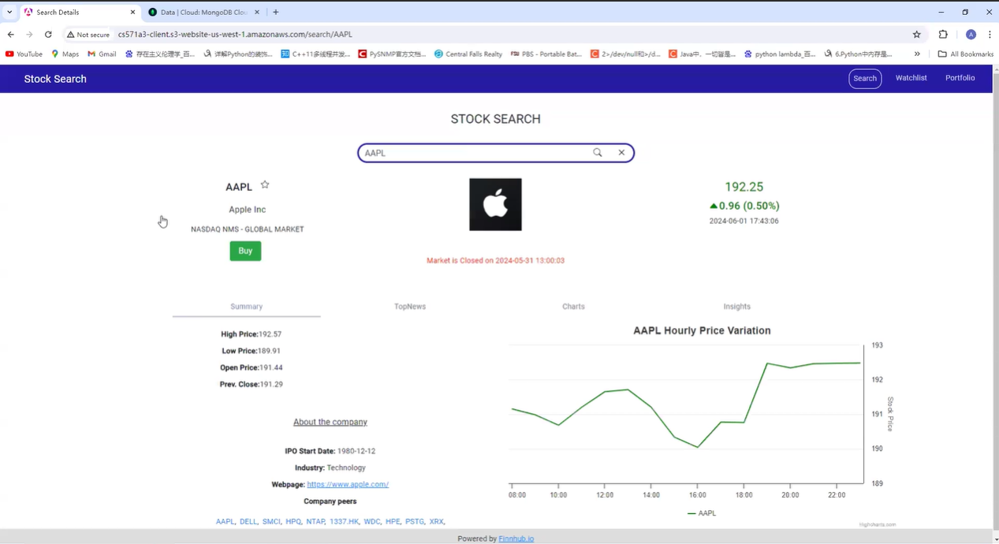
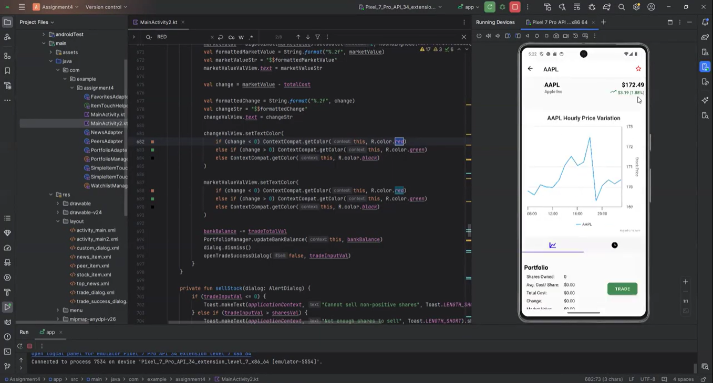

# Stock Trading App
A full-stack stock trading application with real-time market data, subscription features, and stock transactions, built for web and Android platforms.

## Demo

### Web Demo

### Android Demo

## Features
- **Real-Time Market Data**: Access up-to-the-minute stock prices and trends for informed decision-making.
- **Comprehensive Company Information**: Explore detailed profiles, historical data, and insights for listed companies.
- **Cross-Platform Support**: Enjoy a seamless experience on both web and Android platforms, ensuring accessibility anywhere.
- **Stock Transactions**: Easily buy and sell stocks with a user-friendly interface.
- **Premium Subscriptions**: Unlock advanced features and exclusive insights with a subscription plan.

  
## Technologies Used
- **Frontend**: Angular, TypeScript, Bootstrap
- **Backend**: Node.js, Fastify
- **Mobile**: Kotlin, Android SDK
- **Database**: MongoDB
- **Hosting**: AWS
